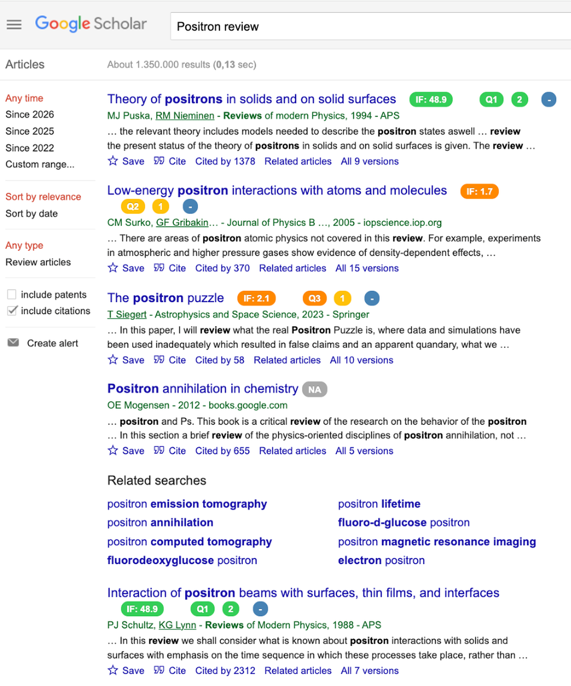
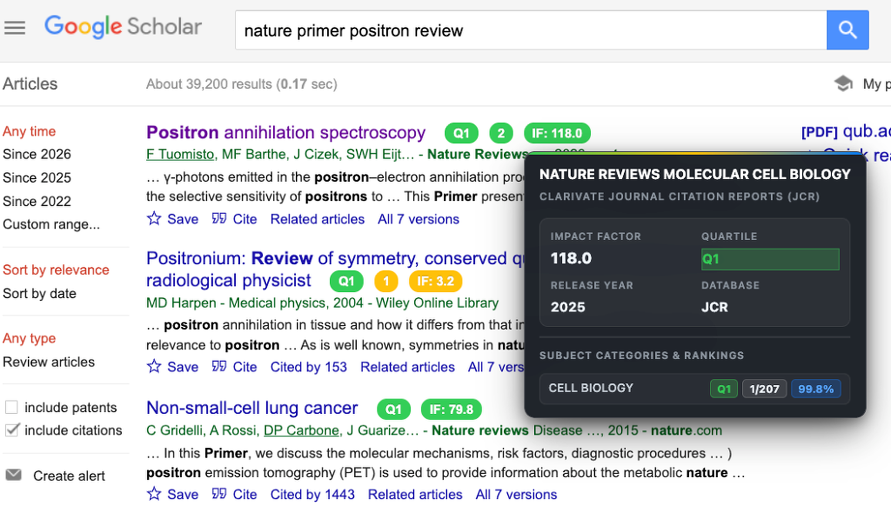

<h1 align="center"> JQR - Kiểm Tra Chất Lượng Tạp Chí Khoa Học</h1>
<h3 align="center">Hiển thị xếp hạng tạp chí ngay trên Google Scholar</h3>

<p align="center">
  <a href="./README.md">🇬🇧 English</a> · <b>🇻🇳 Tiếng Việt</b>
</p>

<p align="center">
  
  
  
  
</p>

> 💡 **Mẹo**: Tải repo về máy rồi mở file [`README_VI.html`](./README_VI.html) bằng trình duyệt để xem bản hướng dẫn đẹp hơn với giao diện premium!

---

## 📌 Giới thiệu

**JQR** là extension trình duyệt giúp **kiểm tra nhanh chất lượng tạp chí khoa học** ngay trên kết quả tìm kiếm Google Scholar — không cần mở tab khác hay tra cứu thủ công.

Extension sẽ **tự động** hiển thị các badge xếp hạng (SJR, Impact Factor, H-Index...) bên cạnh mỗi kết quả, với **màu sắc trực quan** từ 🟢 xanh (chất lượng cao) đến 🔴 đỏ (chất lượng thấp).

---

## ✨ Tính năng chính

| | Tính năng | Mô tả |
|--|----------|-------|
| 📊 | **15+ hệ thống xếp hạng** | SJR, Impact Factor, H-Index, VHB, ABDC, AJG, CORE, CCF, CNRS, FNEGE, FT50, HCERES, BFI, SNIP, CiteScore |
| 🎨 | **Badge màu sắc** | Xanh lá = chất lượng cao, Đỏ = chất lượng thấp |
| 🔍 | **Tìm kiếm tạp chí** | Tra cứu ranking bất kỳ tạp chí nào từ popup |
| 🏷️ | **Phân loại lĩnh vực** | Tự động nhận diện lĩnh vực nghiên cứu |
| 🖱️ | **Hover xem chi tiết** | Di chuột lên badge → xem H-Index, tên tạp chí |
| 🔗 | **Click vào DOI** | Nhấn badge để mở bài báo gốc |
| ⚙️ | **Tùy chỉnh** | Bật/tắt từng ranking theo nhu cầu |

---

## 📸 Hình ảnh minh họa (Preview)

Xếp hạng tạp chí và Impact Factor được tự động tích hợp ngay bên cạnh kết quả tìm kiếm trên Google Scholar với hệ thống badge trực quan và khung hiển thị chi tiết (HUD card).

### 1. Huy hiệu trực tiếp trên kết quả tìm kiếm (Inline Badges)
<p align="center">
  
</p>

- **Huy hiệu tức thì**: Hiển thị `[Q1]`, `[Q2]`, `[Q3]`, `[IF: 48.9]`, `[IF: 2.1]`, `[BFI]`... ngay cạnh tên tạp chí.
- **Đồng bộ màu sắc chuẩn**: Xanh lá đậm (Siêu tinh hoa IF >= 10.0), Xanh lá tươi (Q1 / IF >= 5.0), Vàng (Q2 / IF >= 3.0), Cam (Q3 / IF >= 1.5) và Đỏ (Q4).
- **Liên kết DOI**: Bấm trực tiếp vào huy hiệu để mở bài báo gốc thông qua mã DOI.

### 2. Khung thông tin học thuật chi tiết (Academic Card - "Kính chiếu yêu")
Khi rê chuột lên bất kỳ huy hiệu Quartile hoặc Impact Factor nào, khung thông tin hiện đại sẽ lập tức xuất hiện:

<p align="center">
  
</p>

- **Lưới chỉ số trọng yếu**: Thống kê nhanh Impact Factor, Quartile, Năm phát hành, Cơ sở dữ liệu và H-Index.
- **Bóc tách chi tiết theo từng chuyên ngành (Column AG)**: Hiển thị thứ hạng chính xác trong ngành (ví dụ: `1/180`), phân vị JCI (ví dụ: `99.7%`) và phân hạng Q1–Q4 cho từng lĩnh vực.
- **Hỗ trợ song ngữ (EN / VI)**: Chuyển đổi mượt mà giữa Tiếng Anh và Tiếng Việt, kèm tên gọi thân thuộc *(Kính chiếu yêu)* ở chế độ Tiếng Việt.

---

## 🚀 Hướng dẫn cài đặt

### Cài trên Chrome / Edge / Brave

1. **Tải extension** — nhấn nút **Code → Download ZIP** trên GitHub, rồi giải nén. Hoặc clone:
   ```bash
   git clone https://github.com/trungnvm/JQR-Scholar-Extension.git
   ```

2. **Mở trang extension**:
   - Chrome → `chrome://extensions/`
   - Edge → `edge://extensions/`
   - Brave → `brave://extensions/`

3. **Bật Developer mode** (toggle góc trên bên phải)

4. **Nhấn "Load unpacked"** → chọn thư mục `JQR-Scholar-Extension` (chứa file `manifest.json`)

5. ✅ **Xong!** Icon JQR xuất hiện trên thanh công cụ

---

### Cài trên Firefox

1. Tải extension về máy (như trên)

2. Gõ vào thanh địa chỉ: `about:debugging#/runtime/this-firefox`

3. Nhấn **"Load Temporary Add-on..."** → chọn file `manifest.json`

4. Vào **cài đặt addon** → cấp quyền cho Google Scholar (vd: `https://scholar.google.com.vn`)

> ⚠️ Cài tạm thời trên Firefox sẽ mất khi restart. Để cài vĩnh viễn: [Firefox Add-ons](https://addons.mozilla.org/de/firefox/addon/rapid-journal-quality-check/)

---

## 📖 Cách sử dụng

| Bước | Hành động | Chi tiết |
|------|----------|----------|
| 1 | **Mở Google Scholar** | Truy cập [scholar.google.com](https://scholar.google.com) và tìm kiếm bình thường |
| 2 | **Xem ranking** | Badge xếp hạng xuất hiện **tự động** bên cạnh mỗi kết quả |
| 3 | **Hover & Click** | Di chuột → xem chi tiết. Nhấn → mở DOI bài báo |
| 4 | **Tùy chỉnh** | Nhấn icon JQR trên toolbar để bật/tắt, tìm tạp chí |
| 5 | **Cài đặt nâng cao** | Nhấn "Advanced Settings" trong popup |

---

## 📋 Hệ thống xếp hạng được hỗ trợ

| Viết tắt | Tên đầy đủ | Lĩnh vực |
|----------|-----------|----------|
| **SJR** | SCImago Journal Rank | Đa ngành |
| **JCR** | Journal Citation Reports (Impact Factor) | Đa ngành |
| **ABDC** | Australian Business Deans Council | Kinh doanh |
| **AJG** | Academic Journal Guide (CABS) | Quản trị |
| **CORE** | Computing Research & Education | Công nghệ |
| **CCF** | China Computer Federation | Tin học |
| **CNRS** | Centre National de la Recherche Scientifique | Đa ngành |
| **FNEGE** | Foundation Nationale pour l'Enseignement de la Gestion | Quản trị |
| **FT50** | Financial Times Top 50 | Kinh doanh |
| **HCERES** | High Council for Evaluation of Research | Đa ngành |
| **VHB** | VHB-JOURQUAL 3 & 4 | Kinh doanh |
| **SNIP** | Source Normalized Impact per Paper | Đa ngành |
| **CiteScore** | CiteScore (Scopus) | Đa ngành |
| **BFI** | Bibliometriske Forskningsindikator | Đa ngành |

---

## 📝 Lưu ý

- Extension hoạt động trên **tất cả domain Google Scholar** (.com, .com.vn, .co.uk, ...)
- Dữ liệu ranking được lưu **offline** — không cần internet để tra cứu
- Nếu tạp chí không tìm thấy offline → tự động tra qua **Crossref API**

---

## 🙏 Tác giả & Ghi nhận

- Phát triển bởi **Trung V.M Nguyen**
- Dựa trên extension gốc của [Dr. Julian R. K. Wichmann](https://de.linkedin.com/in/julianwichmann)
- Nền tảng [CCFrank](https://github.com/WenyanLiu/CCFrank4dblp) của WenyanLiu
