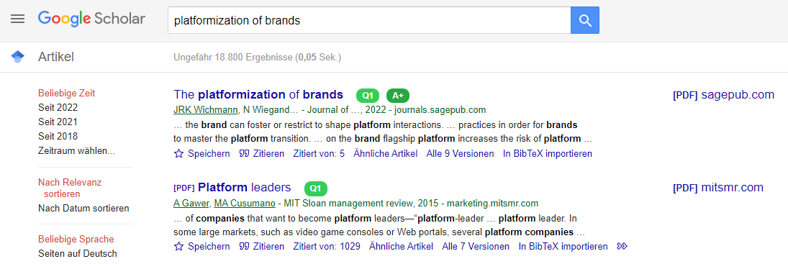

<h1 align="center"> JQR - Journals Quality & Ranking</h1>
<h3 align="center">Instant journal quality metrics on Google Scholar search results</h3>

<p align="center">
  
  
  
  
</p>

---

A browser extension that displays **journal rankings and impact metrics** directly in your [Google Scholar](https://scholar.google.com) search results — so you can assess paper quality at a glance.

## ✨ Features

- 📊 **15+ ranking systems**: SJR, Impact Factor (JCR), H-Index, VHB, ABDC, AJG, CORE, CCF, CNRS, FNEGE, FT50, HCERES, BFI, SNIP, CiteScore
- 🎨 **Color-coded badges**: Green (high quality) → Red (lower quality)
- 🔍 **Journal search**: Look up any journal's rankings directly from the popup
- 🏷️ **Field classification**: Automatic detection of research fields
- 🖱️ **Hover for details**: See H-Index, identified journal name, and more
- 🔗 **Click for DOI**: Navigate directly to the identified work
- ⚙️ **Customizable**: Toggle rankings on/off, choose what to display

## 📸 Preview

Journal rankings appear automatically next to each Google Scholar result:



<br>

Hover over badges for detailed information:


## 🚀 Installation

### Chrome / Edge / Brave (Developer Mode)

1. Download or clone this repository:
   ```bash
   git clone https://github.com/trungnvm/JQR-Scholar-Extension.git
   ```
2. Open Chrome and go to **`chrome://extensions/`**
3. Enable **Developer mode** (toggle in top-right corner)
4. Click **"Load unpacked"**
5. Select the **`JQR-Scholar-Extension`** folder (the one containing `manifest.json`)
6. The extension icon will appear in your toolbar ✅

### Firefox (Temporary Install)

1. Download or clone this repository
2. Open Firefox and go to **`about:debugging#/runtime/this-firefox`**
3. Click **"Load Temporary Add-on..."**
4. Navigate to the `JQR-Scholar-Extension` folder and select **`manifest.json`**
5. Go to the addon settings (top-right) and grant permissions for your Google Scholar domain (e.g. `https://scholar.google.com`)

> ⚠️ Temporary add-ons are removed when Firefox restarts. For permanent install, get it from [Firefox Add-ons](https://addons.mozilla.org/de/firefox/addon/rapid-journal-quality-check/).

## 📖 Usage

1. Install the extension (see above)
2. Go to [Google Scholar](https://scholar.google.com) and search normally
3. Ranking badges will appear **automatically** next to each result
4. Click the **JQR icon** in the toolbar to:
   - Toggle the extension on/off
   - Enable/disable Impact Factor display
   - Enable/disable Field Classification
   - Search for a specific journal
5. Click **"Advanced Settings"** for detailed ranking configuration

## 🏗️ Supported Rankings

| Ranking | Full Name | Source |
|---------|-----------|--------|
| **SJR** | SCImago Journal Rank | [scimagojr.com](https://www.scimagojr.com) |
| **JCR** | Journal Citation Reports (Impact Factor) | Clarivate |
| **VHB** | VHB-JOURQUAL 3 & 4 | [vhbonline.org](https://vhbonline.org) |
| **ABDC** | Australian Business Deans Council | [abdc.edu.au](https://abdc.edu.au) |
| **AJG** | Academic Journal Guide (CABS) | [charteredabs.org](https://charteredabs.org) |
| **CORE** | Computing Research & Education | [portal.core.edu.au](http://portal.core.edu.au) |
| **CCF** | China Computer Federation | [ccf.org.cn](https://www.ccf.org.cn) |
| **CNRS** | Centre National de la Recherche Scientifique | [gate.cnrs.fr](https://www.gate.cnrs.fr) |
| **FNEGE** | Foundation Nationale pour l'Enseignement de la Gestion | [fnege.org](https://www.fnege.org) |
| **FT50** | Financial Times Top 50 | [ft.com](https://www.ft.com) |
| **HCERES** | High Council for Evaluation of Research | [hceres.fr](https://www.hceres.fr) |
| **SNIP** | Source Normalized Impact per Paper | Scopus |
| **CiteScore** | CiteScore | Scopus |
| **BFI** | Bibliometriske Forskningsindikator | Danish Ministry |

## 🙏 Credits

- Original Chrome extension by [Dr. Julian R. K. Wichmann](https://de.linkedin.com/in/julianwichmann)
- Based on [CCFrank](https://github.com/WenyanLiu/CCFrank4dblp) by WenyanLiu
- Uses [Crossref API](https://api.crossref.org) and [dblp API](https://dblp.org)
- Icons from [Flaticon](https://www.flaticon.com/free-icons/research)

## 📄 License

See [LICENSE](./JQR-Scholar-Extension/LICENSE) for details.
